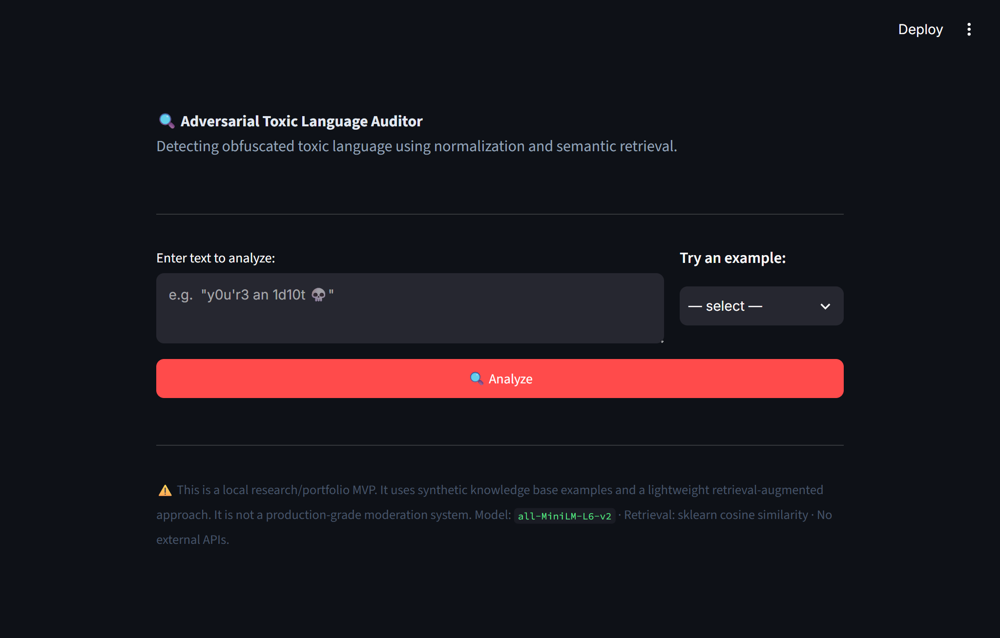
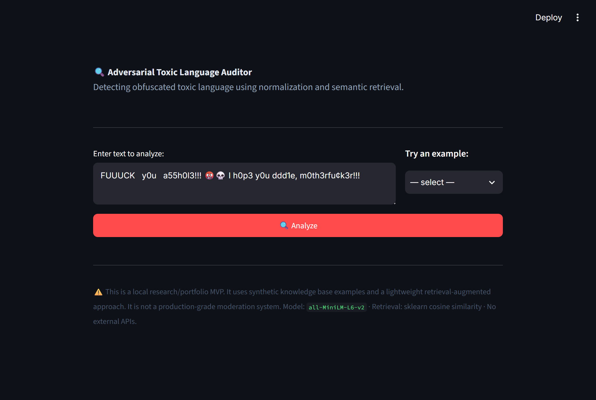
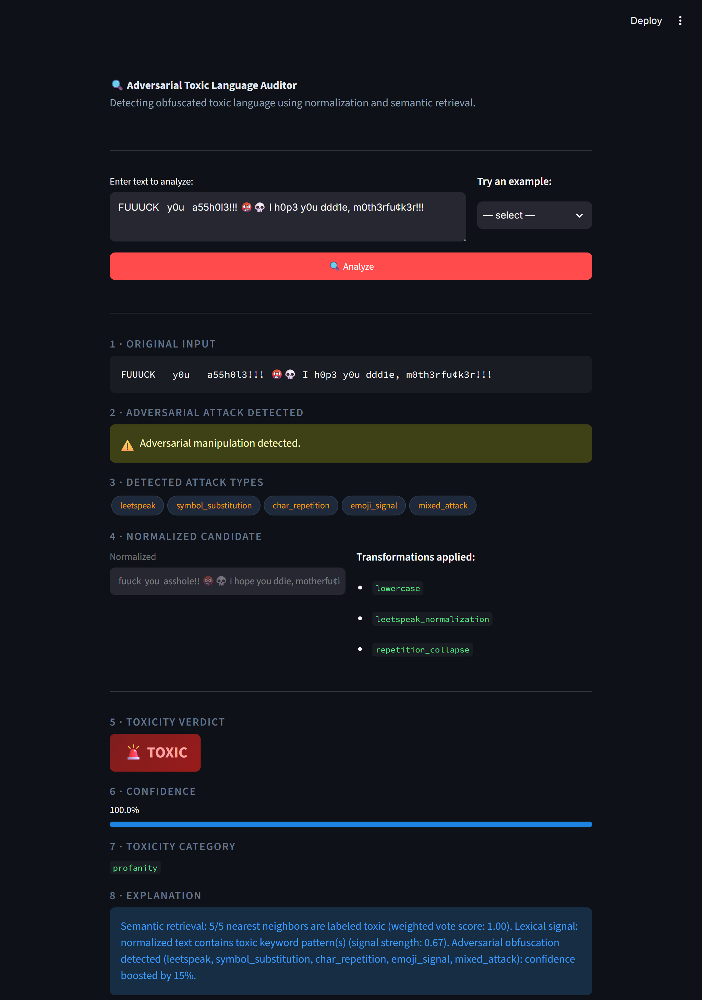
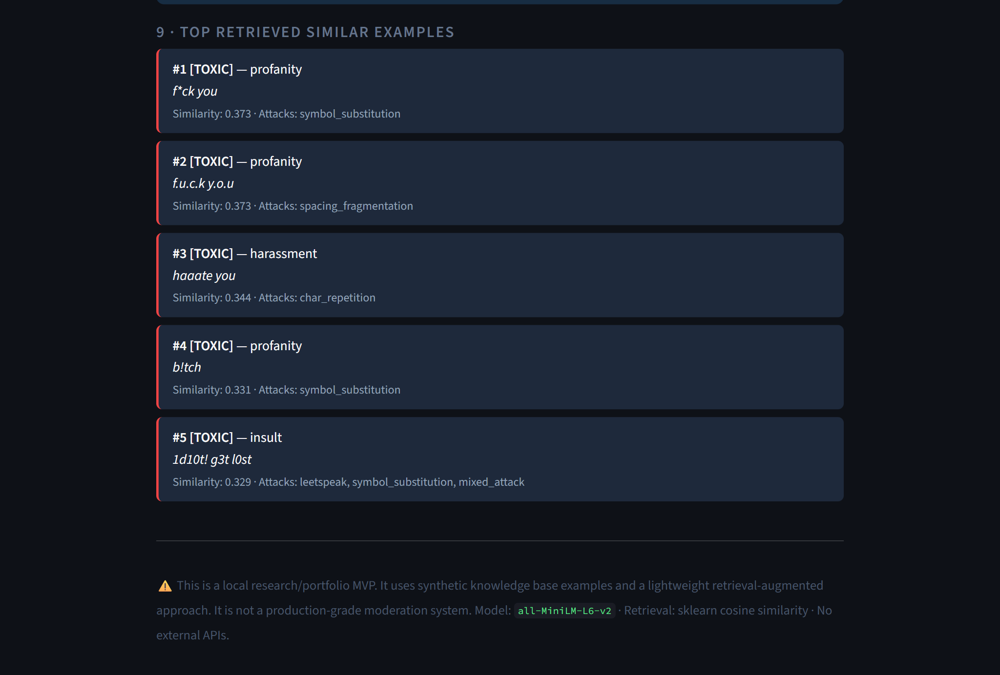
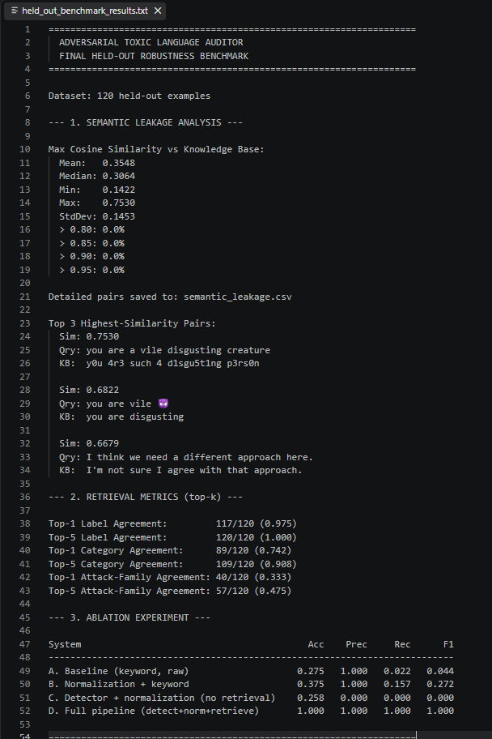

# Adversarial Toxic Language Auditor

A local, retrieval-augmented (RAG) pipeline for detecting obfuscated toxic language that conventional text classifiers can miss.

## Problem

Conventional toxicity classifiers can struggle when users deliberately alter the characters in toxic language. Techniques such as leetspeak, spacing, repeated characters, Unicode homoglyphs, symbol substitution, and toxic emojis can hide the underlying meaning from direct keyword matching and standard text-classification approaches.

For example:

```text
y0u'r3 an 1d10t 💀
i d i o t
stuuuuupid
```

This project was created to investigate whether a local retrieval-augmented pipeline could recover the underlying toxic intent without relying on an external LLM API or custom model fine-tuning.

The system combines adversarial attack detection, conservative text normalization, dense semantic retrieval, and a transparent deterministic scoring engine.

## The Problem With the Initial Approach

The initial keyword-based approach performed poorly on novel adversarial inputs.

On the held-out benchmark:

| System                                 |  Accuracy | Precision |    Recall |        F1 |
| -------------------------------------- | --------: | --------: | --------: | --------: |
| Baseline — keyword only                |     0.275 |     1.000 |     0.022 |     0.044 |
| Normalization + keyword                |     0.375 |     1.000 |     0.157 |     0.272 |
| Detector + normalization, no retrieval |     0.258 |     0.000 |     0.000 |     0.000 |
| **Full RAG pipeline**                  | **1.000** | **1.000** | **1.000** | **1.000** |

The baseline achieved only **2.2% recall** on the held-out adversarial examples.

Normalization recovered some known obfuscation patterns, but the results showed that normalization alone was not enough for novel vocabulary. This motivated the addition of semantic retrieval.

## Development Progression

The project evolved through several progressively stronger configurations:

```text
Raw keyword matching
        ↓
Normalization + keyword matching
        ↓
Attack detection + normalization
        ↓
Normalization + semantic retrieval
        ↓
Full multi-signal RAG pipeline
```

The experiments were used to determine which components actually contributed to robustness rather than assuming that every additional component improved performance.

## Architecture

The complete pipeline processes an input through four main stages:

```text
                    Raw Input
                       │
                       ▼
              ┌─────────────────┐
              │ Attack Detector │
              └────────┬────────┘
                       │
                       ▼
              ┌─────────────────┐
              │   Normalizer    │
              └────────┬────────┘
                       │
                       ▼
              ┌─────────────────┐
              │    Retriever    │
              │     Top-k=5     │
              └────────┬────────┘
                       │
                       ▼
              ┌─────────────────┐
              │   Classifier    │
              └────────┬────────┘
                       │
                       ▼
          Label + Confidence + Category
                  + Explanation
```

The end-to-end pipeline is implemented through:

```text
run_pipeline(text, k=5)
```

which calls:

```text
Detector → Normalizer → Retriever → Classifier
```

## 1. Attack Detection

The attack detector examines the raw input for six obfuscation techniques:

* Leetspeak
* Symbol substitution
* Character repetition
* Spacing fragmentation
* Unicode homoglyphs
* Toxic emoji signals

If two or more attack types are detected, the system additionally assigns a `mixed_attack` signal.

The detector uses regular expressions and Python's `unicodedata` functionality.

### Supported Attack Types

| Attack Type               | Example / Description                                                  |
| ------------------------- | ---------------------------------------------------------------------- |
| **Leetspeak**             | Digits or symbols replacing letters, such as `0 → o`, `1 → i`, `3 → e` |
| **Symbol substitution**   | Symbols inserted inside words such as `b!tch`                          |
| **Character repetition**  | Repeated characters such as `stuuuuupid`                               |
| **Spacing fragmentation** | Inputs such as `i d i o t` or `i.d.i.o.t`                              |
| **Unicode homoglyphs**    | Lookalike characters from another Unicode script                       |
| **Emoji signal**          | Curated toxic-context emoji signals                                    |
| **Mixed attack**          | Two or more attack types occurring together                            |

## 2. Conservative Normalization

The original input is preserved while a normalized representation is produced for retrieval.

The normalization pipeline is:

```text
Unicode NFKD decomposition
        ↓
Lowercasing
        ↓
Fragmentation removal
        ↓
Leetspeak character mapping
        ↓
3+ repeated characters → 2 characters
```

This approach is intentionally conservative. It handles known adversarial transformations without attempting to perform unrestricted spell correction or aggressively modify the input.

For example:

```text
y0u'r3 an 1d10t 💀
```

can be transformed into a cleaner representation such as:

```text
you're an idiot 💀
```

The original text remains available for attack auditing.

## 3. Semantic Retrieval

The normalized input is converted into a dense vector using:

```text
sentence-transformers/all-MiniLM-L6-v2
```

The model produces a **384-dimensional** embedding.

The retrieval knowledge base contains **150 curated examples**. Their embeddings are pre-computed into:

```text
data/kb_embeddings.npy
```

with shape:

```text
(150, 384)
```

The system performs exact cosine similarity using:

```text
sklearn.metrics.pairwise.cosine_similarity
```

and retrieves the top **5** nearest examples.

There is no reranker or pre-filtering model.

There is also no generative LLM prompt. Retrieved labels, categories, and similarity scores are passed directly to the deterministic classifier.

## 4. Deterministic Classification

The classifier combines three signals:

```text
score =
    0.60 × retrieval_score
  + 0.30 × keyword_score
  + 0.10 × attack_flag
```

If an attack is detected, the resulting score receives a `1.15×` multiplier, capped at `1.0`.

The toxicity threshold is:

```text
score >= 0.45 → toxic
```

The classifier produces:

* Toxicity label
* Confidence
* Category
* Explanation

This explicit scoring approach makes the final decision reproducible and auditable.

## Design Decisions

### Why `all-MiniLM-L6-v2`?

The project needed a semantic embedding model that could operate locally without requiring an external API.

`all-MiniLM-L6-v2` provides 384-dimensional embeddings while maintaining a relatively small model footprint of approximately 80 MB and low enough resource requirements for CPU execution.

The model is used with pretrained, frozen weights. No fine-tuning is performed.

### Why NumPy Instead of FAISS or a Vector Database?

The knowledge base contains only 150 examples.

At this scale, an in-memory NumPy matrix combined with exact cosine similarity is sufficient. It avoids introducing additional vector-database infrastructure or C++ dependencies that would add complexity without providing a meaningful benefit for the current dataset size.

The current implementation therefore prioritizes simplicity and auditability.

### Why Conservative Normalization?

Aggressive normalization could alter the meaning of the original message.

The normalizer instead targets known obfuscation patterns while preserving the original input. This allows the system to use a cleaner representation for retrieval without losing the evidence about how the input was originally written.

### Why Deterministic Scoring?

The project is intended to make its decisions inspectable.

The explicit retrieval, keyword, and attack signals make it possible to understand how the final score was produced without depending on the uncertainty of a black-box generative model.

### Why a Separate Held-Out Benchmark?

Retrieval systems can appear effective when evaluation examples are too similar to the examples stored in the knowledge base.

The project therefore includes a separate held-out benchmark and semantic leakage analysis to measure how closely evaluation queries resemble the knowledge base.

## Knowledge Base and Evaluation Data

| Dataset                     | Purpose                                  |        Size | Type                       |
| --------------------------- | ---------------------------------------- | ----------: | -------------------------- |
| `adversarial_examples.json` | Retrieval knowledge base                 | 150 records | Curated / synthetic        |
| `benchmark.csv`             | In-distribution benchmark                | 110 samples | Synthetic                  |
| `held_out_benchmark.csv`    | Out-of-distribution robustness benchmark | 120 samples | Synthetic held-out         |
| `semantic_leakage.csv`      | Query-to-KB similarity analysis          | 120 queries | Generated benchmark output |

The in-distribution benchmark contains:

* 80 toxic samples
* 30 benign samples

The held-out benchmark contains novel vocabulary and phrasing not present in the knowledge base.

## RAG Implementation

The retrieval system uses an item-level knowledge base rather than document chunking.

### Ingestion

`scripts/build_index.py` reads:

```text
data/adversarial_examples.json
```

and encodes the `normalized` field of all 150 records using `all-MiniLM-L6-v2`.

The resulting embeddings are stored in:

```text
data/kb_embeddings.npy
```

### Retrieval

The retriever:

1. Encodes the normalized query.
2. Computes cosine similarity against all 150 knowledge-base embeddings.
3. Sorts the results by similarity.
4. Returns the top 5 records.

The vector matrix is stored as `float32`.

### Context Construction

The retrieved records provide:

* Labels
* Categories
* Similarity scores

These values are passed to the deterministic scoring engine.

No generative context or LLM response is constructed.

## Experiments

### Experiment 1 — In-Distribution Evaluation

**Objective:** Compare keyword matching, normalization, and the full retrieval pipeline.

**Dataset:** `data/benchmark.csv`

**Samples:** 110

* 80 toxic
* 30 benign

| System                               |  Accuracy | Precision |    Recall |        F1 |
| ------------------------------------ | --------: | --------: | --------: | --------: |
| Baseline — keyword only              |     0.518 |     1.000 |     0.338 |     0.505 |
| Normalization + keyword              |     0.845 |     1.000 |     0.787 |     0.881 |
| **Full Pipeline — Norm + Retrieval** | **0.991** | **0.988** | **1.000** | **0.994** |

The full pipeline improved F1 from **0.505** for the baseline to **0.994**.

### In-Distribution Results by Attack Type

| Attack Type |  N | Accuracy | Precision | Recall |    F1 |
| ----------- | -: | -------: | --------: | -----: | ----: |
| clean       | 45 |    0.978 |     0.938 |  1.000 | 0.968 |
| emoji       |  6 |    1.000 |     1.000 |  1.000 | 1.000 |
| leetspeak   | 13 |    1.000 |     1.000 |  1.000 | 1.000 |
| mixed       | 10 |    1.000 |     1.000 |  1.000 | 1.000 |
| repetition  | 10 |    1.000 |     1.000 |  1.000 | 1.000 |
| spacing     | 10 |    1.000 |     1.000 |  1.000 | 1.000 |
| symbol      |  8 |    1.000 |     1.000 |  1.000 | 1.000 |
| unicode     |  8 |    1.000 |     1.000 |  1.000 | 1.000 |

## Experiment 2 — Held-Out Robustness

**Objective:** Evaluate generalization on novel adversarial examples that are not present in the retrieval knowledge base.

**Dataset:** `data/held_out_benchmark.csv`

**Samples:** 120

| System Configuration                      |  Accuracy | Precision |    Recall |        F1 |
| ----------------------------------------- | --------: | --------: | --------: | --------: |
| A. Baseline — keyword, raw                |     0.275 |     1.000 |     0.022 |     0.044 |
| B. Normalization + keyword                |     0.375 |     1.000 |     0.157 |     0.272 |
| C. Detector + normalization, no retrieval |     0.258 |     0.000 |     0.000 |     0.000 |
| **D. Full RAG pipeline**                  | **1.000** | **1.000** | **1.000** | **1.000** |

The held-out benchmark shows the largest difference between the configurations.

The raw keyword baseline achieved only **0.044 F1**, while the full pipeline achieved **1.000 F1**.

The result also demonstrates that the attack detector and normalization stages alone were not sufficient for the held-out vocabulary.

## Experiment 3 — Semantic Leakage and Retrieval Agreement

The held-out benchmark also measures the similarity between each query and the retrieval knowledge base.

### Maximum Cosine Similarity

| Metric                        | Result |
| ----------------------------- | -----: |
| Mean                          | 0.3548 |
| Median                        | 0.3064 |
| Minimum                       | 0.1422 |
| Maximum                       | 0.7530 |
| Standard deviation            | 0.1453 |
| Queries above 0.80 similarity |   0.0% |

No held-out query exceeded the **0.80** similarity threshold.

### Retrieval Agreement

| Metric                            |               Result |
| --------------------------------- | -------------------: |
| Top-5 label agreement             | **100.0% (120/120)** |
| Top-5 toxicity-category agreement |  **90.8% (109/120)** |
| Top-5 attack-family agreement     |   **47.5% (57/120)** |

The lower attack-family agreement is expected from the semantic retrieval design: embeddings can retrieve examples with similar underlying intent even when the exact obfuscation mechanism differs.

For example, a leetspeak insult may retrieve a clean-text insult because the semantic content is similar.

## What the Experiments Showed

The benchmark progression provides three useful observations.

### 1. Normalization Helps

On held-out data, keyword recall increased from:

```text
0.022 → 0.157
```

after normalization.

This means normalization successfully recovered some obfuscated forms that were invisible to the raw keyword baseline.

### 2. Normalization Alone Is Not Enough

The detector + normalization configuration without retrieval scored:

```text
F1 = 0.000
```

on the held-out benchmark.

This indicates that detecting an attack pattern does not by itself provide enough semantic information to classify novel toxic phrases.

### 3. Retrieval Provides the Missing Semantic Signal

The full pipeline combines normalized text with semantic retrieval and reached:

```text
Accuracy = 1.000
Precision = 1.000
Recall = 1.000
F1 = 1.000
```

on the held-out benchmark.

## Failure Cases

The system still has identifiable failure modes.

### Low Attack-Family Retrieval Agreement

Only **47.5%** of held-out queries had top-5 retrieval results matching the query's exact attack family.

The embeddings primarily retrieve according to underlying semantic intent rather than the mechanics of the obfuscation.

This is useful for classification but means retrieval evidence should not be interpreted as an exact match for the attack technique.

### Novel Vocabulary Without Retrieval

The detector + normalization configuration achieved **0.000 F1** on the held-out benchmark.

The normalized novel phrases did not necessarily match the static `TOXIC_KEYWORDS` lexicon, demonstrating the limitation of relying on a fixed keyword set.

### Contextual Ambiguity

The pipeline does not perform conversational context or intent analysis.

For example:

```text
Oh great, you're an idiot
```

can be classified as toxic even when the surrounding conversation could indicate sarcasm or another non-toxic interpretation.

## Limitations

### Small Knowledge Base

The retrieval knowledge base contains only **150 examples**.

This is sufficient for the current portfolio MVP, but a production moderation system would require a substantially larger and more diverse corpus.

### Synthetic Evaluation Data

The knowledge base and benchmark datasets consist of curated synthetic examples rather than large real-world human-annotated moderation datasets.

The current results should therefore be interpreted within the scope of these benchmarks.

### Rule-Based Normalization

The normalizer handles explicitly implemented patterns such as leetspeak, spacing, and character repetition.

It is not a general-purpose spell checker or comprehensive multilingual homoglyph engine.

### Limited Contextual Understanding

The pipeline does not reliably handle:

* Sarcasm
* Irony
* Conversational context
* Benign self-deprecating humor
* More complex interpretations of user intent

### Linear Retrieval

The current vector search scans the entire knowledge base using exact cosine similarity.

This is effectively **O(N)** and works well for 150 entries, but a significantly larger knowledge base would require a scalable approximate-nearest-neighbor indexing strategy.

### Static Keyword Lexicon

The classifier contains a fixed `TOXIC_KEYWORDS` lexicon with **44 strings**.

New vocabulary is therefore not automatically incorporated into the keyword component.

### Fixed Scoring Parameters

The following parameters are hardcoded:

```text
Retrieval weight = 0.60
Keyword weight   = 0.30
Attack weight    = 0.10
Attack boost     = 1.15×
Toxic threshold  = 0.45
```

These values have not been exposed as a learned calibration layer.

### Not a Production Moderation System

The project is a research and portfolio MVP.

It should not be treated as a production moderation system without further engineering, larger real-world datasets, broader language coverage, contextual modeling, and operational safeguards.

## What I Learned

### 1. Normalization Improves Recall, But Retrieval Is the Larger Lever

Normalization improved held-out keyword recall from **0.022 to 0.157**, but semantic retrieval was required to reach **1.000 recall** in the benchmark.

### 2. Dense Embeddings Group by Intent Rather Than Obfuscation

`all-MiniLM-L6-v2` can abstract away much of the character-level variation after normalization.

The retrieval results achieved:

* 100.0% top-5 label agreement
* 90.8% toxicity-category agreement
* 47.5% attack-family agreement

This shows that semantic similarity can remain useful even when the exact adversarial transformation differs.

### 3. Multi-Signal Fusion Handles Different Failure Modes

The detector identifies character-level manipulation.

The normalizer reduces superficial variation.

The retriever provides semantic evidence.

The keyword component provides direct lexical evidence.

Combining these signals produced a more robust system than relying on any single component in the evaluated benchmarks.

### 4. Held-Out Testing Is Important for RAG Systems

A retrieval system should not be evaluated only on examples that may closely resemble its knowledge base.

The semantic leakage analysis provided an additional check on the relationship between the held-out queries and stored examples.

### 5. Simple Infrastructure Can Be the Right Choice at Small Scale

For a 150-example knowledge base, a NumPy matrix and exact cosine similarity are sufficient.

Introducing a vector database would add infrastructure without solving a problem that the current dataset actually has.

## Technology Stack

* **Language:** Python 3.10+
* **Embeddings:** `sentence-transformers`
* **Embedding Model:** `all-MiniLM-L6-v2`
* **Machine Learning:** `scikit-learn`
* **Numerical Processing:** `numpy`
* **Data Processing:** `pandas`
* **Text Processing:** `regex`, `unicodedata`
* **Web Application:** Streamlit
* **Testing:** Pytest
* **Storage:** JSON, CSV, NumPy `.npy`
* **Execution:** CPU
* **External LLM APIs:** None required

The implementation was verified under **Python 3.14.5 on Win32**.

## Installation

### 1. Create a Virtual Environment

```bash
python -m venv venv
```

### 2. Activate the Environment

Windows:

```bash
venv\Scripts\activate
```

Linux/macOS:

```bash
source venv/bin/activate
```

### 3. Install Dependencies

```bash
pip install -r requirements.txt
```

The project uses:

```text
numpy>=1.24
pandas>=1.5
scikit-learn>=1.2
sentence-transformers>=2.2
streamlit>=1.25
regex>=2023.0
pytest>=7.0
```

### 4. Build the Knowledge Base Index

```bash
python scripts/build_index.py
```

The first run downloads `all-MiniLM-L6-v2` (approximately 80 MB) and generates:

```text
data/kb_embeddings.npy
```

## Running the Application

### Streamlit Launcher

```bash
python run.py
```

### Direct Streamlit Launch

```bash
streamlit run app/streamlit_app.py
```

The application provides a single-page interface for entering text and inspecting the detection result, normalization, confidence, category, explanation, and retrieved evidence.

## Running the Tests

```bash
python -m pytest tests/ -v
```

The current test suite contains **53 passing tests** across four test files.

```text
53 passed
```

## Running the Benchmarks

### In-Distribution Benchmark

```bash
python scripts/run_benchmark.py
```

### Held-Out Robustness Benchmark

```bash
python scripts/run_held_out_benchmark.py
```

### Verification Script

```bash
python scripts/verify.py
```

## Screenshots

### Application Landing Page



### Obfuscated Input



### Analysis Result



### Retrieval Evidence



### Benchmark Results



## Project Structure

```text
adversarial-toxic-rag/
├── app/
│   └── streamlit_app.py
│
├── data/
│   ├── adversarial_examples.json
│   ├── benchmark.csv
│   ├── benchmark_results.txt
│   ├── held_out_benchmark.csv
│   ├── held_out_benchmark_results.txt
│   ├── kb_embeddings.npy
│   └── semantic_leakage.csv
│
├── src/
│   ├── __init__.py
│   ├── classifier.py
│   ├── detector.py
│   ├── embeddings.py
│   ├── normalizer.py
│   ├── pipeline.py
│   └── retriever.py
│
├── scripts/
│   ├── build_index.py
│   ├── run_benchmark.py
│   ├── run_held_out_benchmark.py
│   └── verify.py
│
├── tests/
│   ├── test_detector.py
│   ├── test_normalizer.py
│   ├── test_pipeline.py
│   └── test_held_out_benchmark.py
│
├── screenshots/
│   ├── 01_home.png
│   ├── 02_obfuscated_input.png
│   ├── 03_analysis_result.png
│   ├── 04_retrieval_evidence.png
│   └── 05_benchmark_results.png
│
├── .gitignore
├── README.md
├── requirements.txt
└── run.py
```

## Repository Components

| Component                           | Responsibility                                |
| ----------------------------------- | --------------------------------------------- |
| `src/detector.py`                   | Detects adversarial obfuscation patterns      |
| `src/normalizer.py`                 | Performs conservative text normalization      |
| `src/embeddings.py`                 | Generates sentence embeddings                 |
| `src/retriever.py`                  | Performs cosine-similarity retrieval          |
| `src/classifier.py`                 | Calculates the deterministic toxicity score   |
| `src/pipeline.py`                   | Orchestrates the complete pipeline            |
| `app/streamlit_app.py`              | Streamlit user interface                      |
| `scripts/build_index.py`            | Builds the knowledge-base embedding index     |
| `scripts/run_benchmark.py`          | Runs the in-distribution benchmark            |
| `scripts/run_held_out_benchmark.py` | Runs held-out evaluation and leakage analysis |
| `scripts/verify.py`                 | Verification launcher                         |
| `tests/`                            | Unit and integration tests                    |

## Final Results

The project was built around a specific weakness in conventional toxicity detection: obfuscating the characters can make toxic language difficult for direct lexical approaches to recognize.

The final pipeline addresses that weakness through:

```text
Attack Detection
        +
Conservative Normalization
        +
Dense Semantic Retrieval
        +
Deterministic Multi-Signal Scoring
```

The measured results were:

| Evaluation                    | Baseline F1 | Improved / Full Pipeline F1 |
| ----------------------------- | ----------: | --------------------------: |
| In-distribution — 110 samples |       0.505 |                   **0.994** |
| Held-out — 120 samples        |       0.044 |                   **1.000** |

The held-out evaluation also recorded a maximum query-to-knowledge-base cosine similarity of **0.7530**, with **0.0%** of queries exceeding 0.80 similarity.

The current implementation passes **53 pytest tests**.

These results demonstrate the effectiveness of the approach on the provided synthetic benchmarks, while the small knowledge base, synthetic data, static rules, linear retrieval, and limited contextual understanding define the current boundaries of the system.
